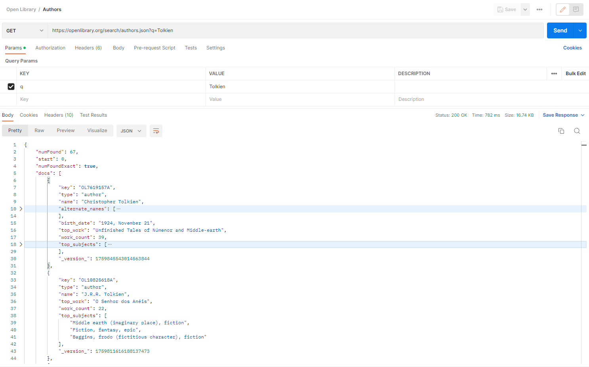
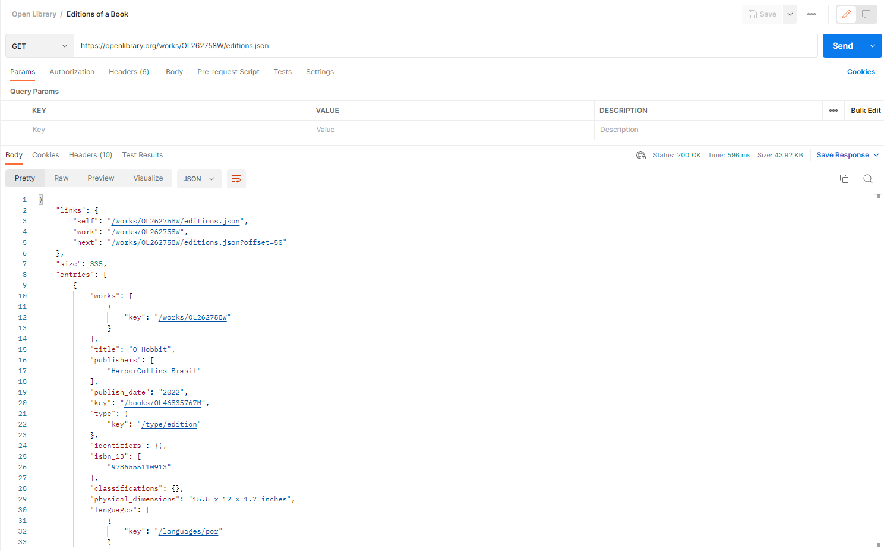
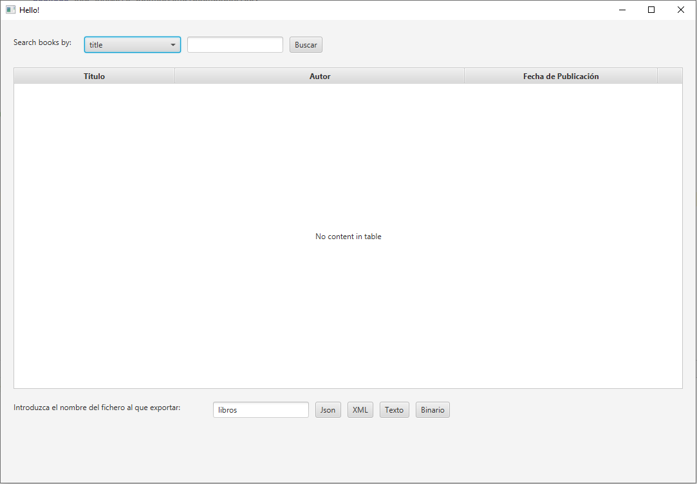
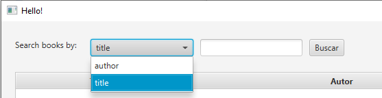
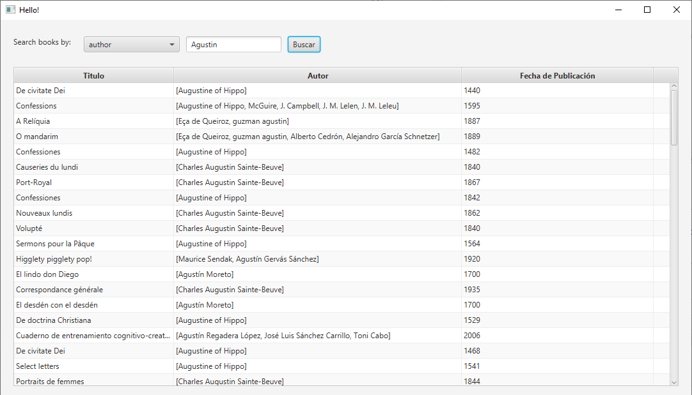
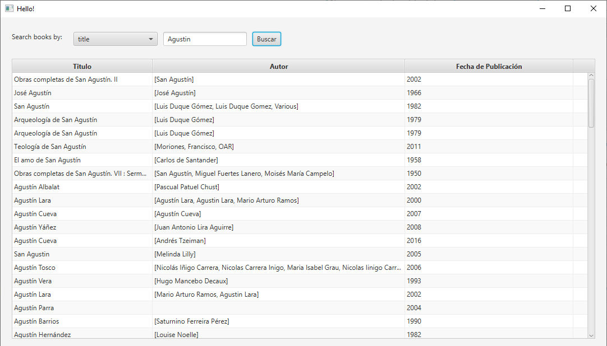

# Open Library API

### ¿Que es Open Library?

Open Library es una biblioteca online para consultar libros y ediciones de libros y poder leerlas.

Open Library API es la API que usa Open Library y permite buscar datos de forma sencilla.

Esta aplicación consulta la API de Open Library para poder buscar libros por autor o por titulo.

### Capturas Postman

### Manual  técnico para desarrolladores 

Este proyecto usa el patrón MVC

El modelo es la API que se recibe en pojos definidos en el paquete model

La vista usa la librería JavaFX y esta definida en el archivo 
[hello-view.fxml](src/main/resources/com/example/proyectoud1recuperacion/hello-view.fxml)

El controlador es [HelloControler.java](src/main/java/com/example/proyectoud1recuperacion/HelloController.java)
que se encarga de procesar los datos que devuelve la API para poder mostrarlos.

[HelloApplication.java](src/main/java/com/example/proyectoud1recuperacion/HelloApplication.java) es el archivo que usa
JavaFX como punto de inicio de la aplicación.

### Manual de usuario

Nuestra app es muy sencilla.

Como podeis ver tiene una Linea para buscar libros por su titulo o por su autor lo cual seleccionamos mediante un
ComboBox.

Una tabla en la que puedes buscar por Autor o por titulo.

Y una linea en la que podemos decidir exportar los datos, el nombre del fichero y en que formato exportarlo.

### Propuestas de mejora

Paginar para poder acceder a toda la busqueda pues la API solo te devuelve los 100 primeros libros que encuentra.

Poder decidir donde te guarda los ficheros que exportas.

Poder importar datos de un fichero previamente exportado.

### Conclusiones y opinión

Fue un proyecto pequeño y sencillo (Al que le dediqué menos de 10 horas) que me sirvió para ver como interactuan las
interfaces graficas con el código y coger un poco de soltura en el apartado de diseño gráfico.

Estoy medianamente contento con el resultado pues aunque hay mejoras posibles es funcional.

Puesto que cumple todos los requisitos espero tener una buena nota (7-8).

